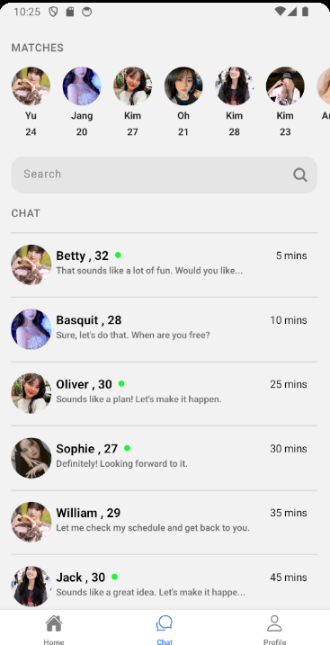
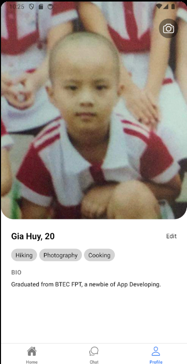
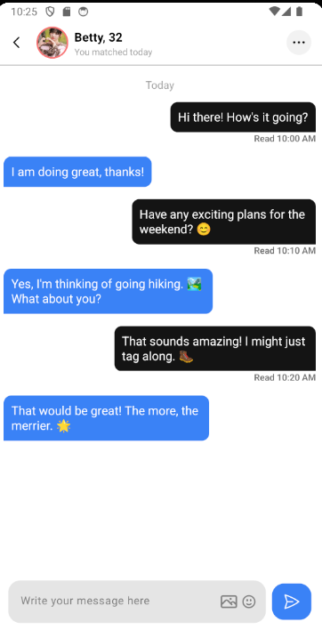

<h3 align="center">Dating-App created by React Native (Frontend)</h3>

  
  
Home Page

  
  
Mini Portal

  
  
Detail Modal

  
  
Grid Genre Page

  
  
Watch Page with customer contol bar

A simple welcome screen using views and classnames.

A home screen with a small profile picture on top and a navigator to slide between potential matches.

A screen which show the chats with whom you have matched and have conversed.

A profile page to show how you look, your hobbies and your biography to others.

A chat screen to show the conversation you have had with your matches.

React Native documentary: https://reactnative.dev/docs/getting-started

